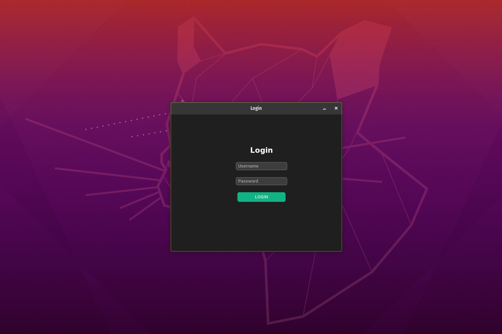

# Login with tkinter
 Apenas uma tela de login com tkinter

## Pré-requisitos

Antes de começar, verifique se você atendeu aos seguintes requisitos:

* Você instalou o python 3.+ ou posterior.
* Você tem uma máquina `Windows ou Linux`.

## Preparando o ambiente
No terminal ou cmd digite:
```
pip install -r requirements.txt
```

## Iniciando a aplicação

Para iniciar, siga estas etapas no diretório raiz:

Linux e macOS:
```
python3 main.pyw
```

Windows:
```
python main.pyw
```
## Exemplo




## Colaboradores

Obrigado às seguintes pessoas que contribuíram para este projeto:

* [@sweydmanaf](https://github.com/sweydmanaf) 📖


## Contato

Se quiser entrar em contato comigo, você pode entrar em contato comigo em <abdulsweyd@gmail.com>.
